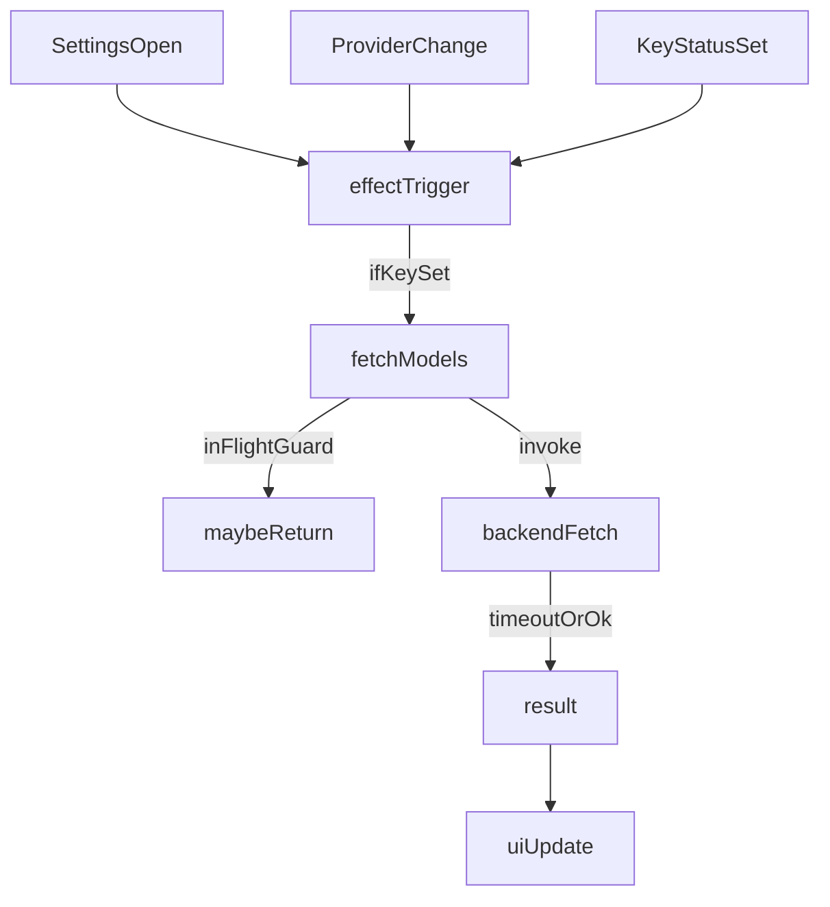

## What’s happening (based on your screenshot)

- The UI is stuck in **Loading available models...** while the provider is **OpenAI** and the key is set.
- In `[src/components/SettingsPanel.tsx](d:\Claude CODE\SpeakEasy\src\components\SettingsPanel.tsx)`, `fetchModelsForProvider(true)` is called from a `useEffect` that depends on `fetchModelsForProvider`.
- But `fetchModelsForProvider` is recreated whenever `isLoadingModels`, `lastModelsFetch`, or `providerModels.length` changes (they’re in its dependency list). That means the effect can retrigger repeatedly and call `fetchModelsForProvider(true)` again (force bypasses the “already loading” guard), causing overlapping requests and a UI that appears permanently loading.

## Fix approach

### 1) Frontend: stop the refetch loop and guarantee loading always ends

File: `[src/components/SettingsPanel.tsx](d:\Claude CODE\SpeakEasy\src\components\SettingsPanel.tsx)`

- Refactor model fetching to use **refs** for in-flight + caching state so the fetch function stays stable:
  - `inFlightRef` (boolean)
  - `lastFetchRef` (number)
  - optionally `modelsRef` (for caching decisions)
- Change the forced fetch behavior so **force still respects in-flight**:
  - If a request is already in-flight, immediately return.
- Update the `useEffect` that auto-fetches models so it only depends on:
  - `isSettingsOpen`
  - `settings.transformProvider`
  - current provider key status (`getCurrentProviderKeyStatus()?.is_set` or derived boolean)
  - and uses a stable fetch function (no dependency on `isLoadingModels` state)
- Add a frontend safety timeout so the UI can never be stuck forever even if the backend hangs:
  - Wrap `invoke("fetch_provider_models")` in `Promise.race([... , timeout])`
  - On timeout, set `modelsError` and clear `isLoadingModels`
- UX improvement: while loading, still show an **“Enter model ID manually”** input (so user isn’t blocked).

### 2) Backend: add request timeouts for model fetch

File: `[src-tauri/src/commands.rs](d:\Claude CODE\SpeakEasy\src-tauri\src\commands.rs)`

- Use `reqwest::ClientBuilder` with timeouts for `fetch_openai_models` and `fetch_openrouter_models`, e.g.:
  - connect timeout ~ 5s
  - overall request timeout ~ 15s
- Improve error messages for timeouts / DNS / connect failures (so UI shows actionable errors instead of hanging).

### 3) Verify end-to-end

- Run the installed app build flow:
  - `npm run tauri build`
  - install the generated NSIS exe
- Confirm that:
  - Models either populate, **or** show a clear error within timeout
  - “Refresh” works and doesn’t trigger infinite loading
  - Manual model entry works even if fetch fails

### 4) Ship a new updater-ready build

- Produce updated installer at:
  - `src-tauri/target/release/bundle/nsis/*.exe`

## Data flow (fixed)

