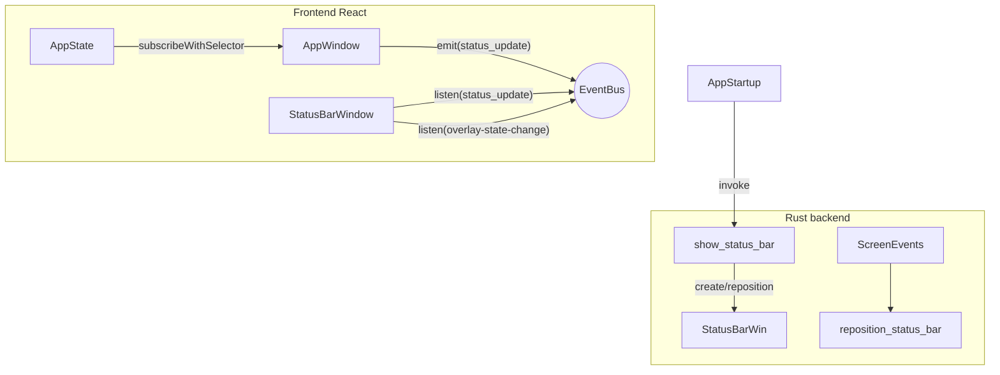

# Robust Always-on-Top Status Bar (Bottom-Right)

We will extract `StatusIndicator` into a dedicated transparent window that is always visible in the lower-right corner of the **primary monitor**, survives display changes, and never steals focus.

Major considerations addressed:

- **Window lifecycle** – create once on app startup; if user closes it or display config changes, backend command recreates/repositions it on demand (mirrors existing overlay logic).
- **Build pipeline** – add `statusbar.html` to Vite multi-page build; ensure resources copied to `dist` & `tauri.conf.json -> build.frontendDist` path.
- **IPC synchronisation** – instead of high-frequency polling, emit store deltas whenever relevant fields change (`recordingState`, `recordingStartTime`) using Zustand’s `subscribeWithSelector` to minimise chatter; status window listens and updates local UI.
- **Cross-platform positioning** – backend obtains monitor geometry & scale factor each time it shows/repositions the window, so DPI / multi-monitor changes are handled gracefully. Margin leaves clearance for taskbar/dock regardless of OS.
- **Click-through (optional)** – add CSS `pointer-events:none` so bar never blocks mouse; window created with `focus:false` so it won’t steal focus when shown.
- **Hide during overlay** – when recording overlay is shown it can occlude the bar; we’ll hide the status bar automatically while the overlay is visible by piggy-backing on the existing `overlay-state-change` events.
- **Settings toggle (future-proof)** – expose a boolean in Settings to enable/disable the floating bar; default ON.

Detailed steps (additions in **bold** mark the gaps filled):

1. **Config: status-bar window** (tauri.conf.json)

   - width 220, height 80, transparent, decorations false, alwaysOnTop true, skipTaskbar true, focus false, visible false.

2. **Vite multi-page**

   - Update `vite.config.ts` `build.rollupOptions.input` to include `statusbar.html`. Ensure dev server routes.

3. **HTML & entrypoint**

   - Create `public/statusbar.html` (or sibling of overlay.html) with script tag pointing to `statusbar.tsx`.
   - Create `src/statusbar.tsx` which mounts `<StatusBarWindow/>` component.

4. **UI component**

   - `StatusBarWindow.tsx` renders `<StatusIndicator/>` in a small flex container with rounded bg & drop shadow.
   - CSS: `pointer-events:none` on wrapper.

5. **Store sync via events**

   - In `App.tsx` add:
```ts
const selector = (s: AppState) => ({
  recordingState: s.recordingState,
  recordingStartTime: s.recordingStartTime,
});
useEffect(() => {
  const unsub = useAppStore.subscribe(selector, (current) => {
    emit("status_update", current);
  });
  return unsub;
}, []);
```

   - (Emit goes to all windows; status bar filters locally.)

6. **Status listener**
```ts
useEffect(() => {
  const unlisten = listen<typeof selector>("status_update", ({ payload }) => setData(payload));
  return () => { unlisten.then(fn=>fn()); };
}, []);
```


   - Also listen for `overlay-state-change` → hide/show accordingly.

7. **Backend command: show_status_bar**

   - Mirror `show_recording_overlay`; create if missing, calculate position each call using current primary monitor metrics and margin (12px, 12px). Expose via `tauri::command`.
   - New helper `reposition_status_bar()` called on `tauri://scale-change` & `tauri://resize` events (register global event listener in `main.rs`).

8. **Startup hook**

   - After `initialize()` finishes, invoke `show_status_bar` once.

9. **Window recreation guard**

   - If status-bar closed manually (unlikely) or fails to show, command recreates with builder identical to config.

10. **Settings toggle (optional now)**

   - Add boolean `showStatusBar` default true; in SettingsPanel add checkbox; in `App.tsx` only invoke show_status_bar when enabled.

11. **QA matrix**

   - Test on Windows & macOS with: single display, dual-display (primary change), DPI scaling 125–200 %, light/dark backgrounds, alt+tab cycling, overlay interactions.
   - Verify CPU impact of event sync (<0.1 % idle).
