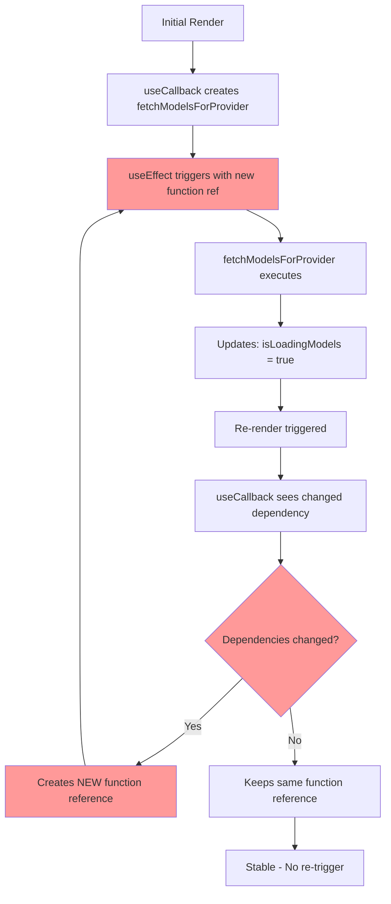

# Bug #02: fetchModels Infinite Loop Risk

**Bug ID:** BUG-002  
**Date Identified:** December 14, 2025  
**Priority:** Critical 🔴  
**Severity:** High - Can cause UI freeze and performance degradation  
**Status:** Open  
**Estimated Fix Time:** 1-2 hours  

---

## Affected Files

- [`src/components/SettingsPanel.tsx`](../../src/components/SettingsPanel.tsx) - Lines 168-203

---

## Description

The `fetchModelsForProvider` function is wrapped in a `useCallback` hook with a dependency array that includes state values which change during the function's execution (`isLoadingModels`, `lastModelsFetch`, `providerModels.length`). This causes the callback to be recreated unnecessarily, which can trigger the dependent `useEffect` (lines 211-215) to run repeatedly, potentially creating an infinite loop.

### User-Facing Impact

- Settings panel may become unresponsive when changing transform provider
- Excessive API calls to fetch model lists
- UI freezes during model loading
- Poor user experience when configuring AI Transform settings
- Increased API costs from redundant requests

---

## Root Cause Analysis

### Technical Explanation

React's `useCallback` hook is meant to memoize functions so they maintain the same reference across renders unless dependencies change. However, when dependencies include state that the function itself modifies, it creates a cycle:

1. Component renders with initial state
2. `fetchModelsForProvider` is created with current state values
3. Function executes and updates state (`isLoadingModels`, `lastModelsFetch`, `providerModels`)
4. State change triggers re-render
5. `useCallback` sees changed dependencies and creates new function reference
6. `useEffect` (line 211) sees new function reference and runs again
7. Cycle repeats → potential infinite loop

### Current Code (Problematic)

```typescript:src/components/SettingsPanel.tsx
const fetchModelsForProvider = useCallback(async (force = false) => {
  const keyStatus = getCurrentProviderKeyStatus();
  if (!keyStatus?.is_set) {
    setProviderModels([]);
    setModelsError(null);
    return;
  }

  // Skip if already loading or if fetched recently (within 30 seconds) unless forced
  const now = Date.now();
  if (!force && (isLoadingModels || (now - lastModelsFetch < 30000 && providerModels.length > 0))) {
    return;
  }

  setIsLoadingModels(true);  // ← Changes dependency
  setModelsError(null);
  
  try {
    const models = await invoke<ProviderModel[]>("fetch_provider_models", {
      provider: settings.transformProvider,
    });
    setProviderModels(models);  // ← Changes dependency
    setLastModelsFetch(Date.now());  // ← Changes dependency
    
    if (models.length > 0 && !models.some(m => m.id === settings.transformModel)) {
      updateSettings({ transformModel: models[0].id });
    }
  } catch (error) {
    console.error("Failed to fetch models:", error);
    setModelsError(String(error));
    setProviderModels([]);
  } finally {
    setIsLoadingModels(false);  // ← Changes dependency
  }
}, [settings.transformProvider, settings.transformModel, getCurrentProviderKeyStatus, updateSettings, isLoadingModels, lastModelsFetch, providerModels.length]);
//  ↑ These state values change during execution, causing callback recreation
```

### Why This Is Problematic

1. **Performance:** Unnecessary function recreations on every state change
2. **Infinite Loop Risk:** useEffect can trigger repeatedly when dependencies cycle
3. **API Abuse:** Multiple redundant requests to model provider APIs
4. **Memory:** Creates new function closures on every render
5. **Debugging:** Race conditions make bugs hard to reproduce

### Flow Diagram



---

## Reproduction Steps

### Prerequisites
- SpeakEasy desktop app running
- Settings panel open
- Transform provider API key configured

### Steps to Reproduce

1. Open Developer Tools / Console
2. Add logging to track function recreation:
   ```typescript
   console.log('fetchModelsForProvider recreated', Date.now());
   ```
3. Open Settings → AI Transform Settings
4. Change the "Provider" dropdown to a different provider
5. Observe console logs

**Expected Behavior:** Function recreates once when provider changes  
**Actual Behavior:** Function may recreate multiple times, potentially triggering multiple API calls

### Conditions That Exacerbate the Issue

- Rapid provider switching
- Slow API responses (keeps `isLoadingModels` true longer)
- No models returned (providerModels.length stays at 0)
- Network latency causing delayed state updates

---

## Proposed Fix

### Solution

Remove state values from the dependency array that are only used for guards/checks, not for the function's core logic:

#### Before (Problematic)
```typescript
}, [settings.transformProvider, settings.transformModel, getCurrentProviderKeyStatus, updateSettings, isLoadingModels, lastModelsFetch, providerModels.length]);
```

#### After (Fixed)
```typescript
}, [settings.transformProvider, settings.transformModel, getCurrentProviderKeyStatus, updateSettings]);
```

### Rationale

The removed dependencies (`isLoadingModels`, `lastModelsFetch`, `providerModels.length`) are:
- **Read** in the function to make decisions (guards)
- **Updated** by the function itself
- Not used to compute the function's output or behavior
- Always accessed via closure (already have latest values when function runs)

The remaining dependencies are:
- **External inputs** that determine what the function should fetch
- **Stable function references** that don't cause unnecessary re-renders
- **True dependencies** that should trigger re-creation when they change

### Complete Fixed Code

```typescript:src/components/SettingsPanel.tsx
const fetchModelsForProvider = useCallback(async (force = false) => {
  const keyStatus = getCurrentProviderKeyStatus();
  if (!keyStatus?.is_set) {
    setProviderModels([]);
    setModelsError(null);
    return;
  }

  // These values are always current via closure, no need in deps array
  const now = Date.now();
  if (!force && (isLoadingModels || (now - lastModelsFetch < 30000 && providerModels.length > 0))) {
    return;
  }

  setIsLoadingModels(true);
  setModelsError(null);
  
  try {
    const models = await invoke<ProviderModel[]>("fetch_provider_models", {
      provider: settings.transformProvider,
    });
    setProviderModels(models);
    setLastModelsFetch(Date.now());
    
    if (models.length > 0 && !models.some(m => m.id === settings.transformModel)) {
      updateSettings({ transformModel: models[0].id });
    }
  } catch (error) {
    console.error("Failed to fetch models:", error);
    setModelsError(String(error));
    setProviderModels([]);
  } finally {
    setIsLoadingModels(false);
  }
}, [settings.transformProvider, settings.transformModel, getCurrentProviderKeyStatus, updateSettings]);
//  ↑ Only true dependencies that determine WHAT to fetch
```

### Alternative Approaches Considered

1. **useRef for State Values:**
   ```typescript
   const isLoadingRef = useRef(isLoadingModels);
   useEffect(() => { isLoadingRef.current = isLoadingModels; }, [isLoadingModels]);
   ```
   - Pros: Explicit about reading current state
   - Cons: More boilerplate, harder to maintain
   - Recommendation: Not needed, closure already provides this

2. **Separate Effects:**
   ```typescript
   // One effect for provider changes
   // Another effect for API key changes
   ```
   - Pros: Clearer separation of concerns
   - Cons: More complex, harder to coordinate
   - Recommendation: Current structure is fine once deps are fixed

3. **Remove useCallback:**
   ```typescript
   // Just define function in component body
   const fetchModelsForProvider = async (force = false) => { /* ... */ }
   ```
   - Pros: Simpler, no dependency issues
   - Cons: Creates new function every render (but that's okay if not passed as prop)
   - Recommendation: Keep useCallback since function is passed to useEffect

**Recommended:** Fix #1 (remove unnecessary dependencies) - simplest and most correct

---

## Testing Plan

### Unit Tests

Create test file: `src/components/__tests__/SettingsPanel.fetchModels.test.tsx`

```typescript
describe('fetchModelsForProvider', () => {
  it('should not recreate callback when loading state changes', () => {
    const { rerender } = render(<SettingsPanel />);
    
    // Get initial function reference
    const initialCallback = /* capture callback ref */;
    
    // Trigger loading state change
    act(() => {
      // Start fetching models
    });
    
    rerender(<SettingsPanel />);
    
    // Verify function reference is stable
    expect(/* current callback */).toBe(initialCallback);
  });

  it('should recreate callback when provider changes', () => {
    const { rerender } = render(<SettingsPanel />);
    
    const initialCallback = /* capture callback ref */;
    
    // Change provider
    act(() => {
      updateSettings({ transformProvider: 'openai' });
    });
    
    rerender(<SettingsPanel />);
    
    // Function should be recreated
    expect(/* current callback */).not.toBe(initialCallback);
  });

  it('should not trigger multiple API calls on rapid state changes', async () => {
    const mockInvoke = jest.fn().mockResolvedValue([]);
    
    render(<SettingsPanel />);
    
    // Trigger multiple rapid state updates
    act(() => {
      // Simulate rapid clicks or state changes
    });
    
    await waitFor(() => {
      // Should only call API once, not multiple times
      expect(mockInvoke).toHaveBeenCalledTimes(1);
    });
  });
});
```

### Integration Tests

```typescript
describe('SettingsPanel model fetching integration', () => {
  it('should handle provider switch without excessive renders', async () => {
    const renderSpy = jest.fn();
    
    render(<SettingsPanel />);
    
    // Switch provider
    await userEvent.selectOptions(
      screen.getByLabelText('Provider'),
      'anthropic'
    );
    
    // Verify reasonable number of renders (not infinite)
    expect(renderSpy).toHaveBeenCalledTimes(expect.lessThan(10));
  });

  it('should fetch models once per provider change', async () => {
    const apiSpy = jest.spyOn(/* API module */, 'invoke');
    
    render(<SettingsPanel />);
    
    // Change provider twice
    await changeProvider('openai');
    await changeProvider('anthropic');
    
    // Should have fetched exactly twice (once per provider)
    expect(apiSpy).toHaveBeenCalledWith('fetch_provider_models', 
      expect.objectContaining({ provider: 'openai' })
    );
    expect(apiSpy).toHaveBeenCalledWith('fetch_provider_models',
      expect.objectContaining({ provider: 'anthropic' })
    );
    expect(apiSpy).toHaveBeenCalledTimes(2);
  });
});
```

### Performance Tests

```typescript
describe('SettingsPanel performance', () => {
  it('should not cause excessive re-renders', () => {
    const { rerender } = render(<SettingsPanel />);
    
    // Track render count
    let renderCount = 0;
    // Add render counter

    // Trigger state changes
    act(() => {
      // Simulate normal usage
    });
    
    // Should not exceed reasonable render count
    expect(renderCount).toBeLessThan(20);
  });
});
```

### Manual Testing Checklist

- [ ] Open Settings → AI Transform Settings
- [ ] Add API key for OpenRouter
- [ ] Observe models load without freezing
- [ ] Switch to OpenAI provider
- [ ] Verify models fetch once, not repeatedly
- [ ] Switch back and forth between providers rapidly
- [ ] Monitor console for excessive fetch attempts
- [ ] Verify no UI freezing or performance degradation
- [ ] Test with slow network (throttle to 3G)
- [ ] Verify 30-second cache works correctly
- [ ] Test with API key removed (should not crash)

### Edge Cases to Verify

1. **No API Key:** Should not attempt fetches
2. **API Error:** Should not retry infinitely
3. **Empty Model List:** Should not trigger re-fetch loop
4. **Concurrent Provider Changes:** Should cancel previous requests
5. **Component Unmount During Fetch:** Should not update state after unmount

---

## Related Context

### React Best Practices

From React documentation on useCallback:
> Include all values from the component scope that change over time and are used by the callback...However, if those values are only read and not used to compute the result, they don't need to be in the dependency array.

This bug violates the principle by including read-only guard values that don't affect the computation.

### Lessons Learned References

No previous documentation in [`lessons-learned/`](../../lessons-learned/) about useCallback dependency patterns. Consider adding after fix.

### SRS Requirements

From [`speakeasy-srs.md`](../../speakeasy-srs.md):

**NFR-P001: Transcription Latency**
> <5 seconds for recordings <30 seconds

**NFR-P007: Web Dashboard Load Time**
> <3 seconds initial load

This bug can violate these performance requirements by causing UI freezes and excessive API calls.

### Related Bugs

- **Bug #04 (Recording Overlay Race Condition):** Similar pattern of state in useEffect deps
- Consider documenting useCallback/useEffect patterns as team coding standard

---

## Implementation Checklist

- [ ] Update `src/components/SettingsPanel.tsx` line 203
- [ ] Remove `isLoadingModels`, `lastModelsFetch`, `providerModels.length` from deps
- [ ] Add code comment explaining why these aren't in deps
- [ ] Run ESLint to verify no warnings
- [ ] Add unit tests for callback stability
- [ ] Add integration tests for fetch behavior
- [ ] Manual test with provider switching
- [ ] Monitor console for excessive fetch logs
- [ ] Performance test with React DevTools Profiler
- [ ] Document pattern in team coding standards

---

## Post-Fix Validation

### Success Criteria

1. ✅ useCallback only recreates when provider or model settings change
2. ✅ No excessive API calls when loading state changes
3. ✅ Settings panel remains responsive during model fetching
4. ✅ 30-second cache works correctly
5. ✅ No console errors or warnings
6. ✅ Unit and integration tests pass
7. ✅ Performance profile shows stable render count

### Metrics to Monitor

- Render count: Should be < 10 for typical provider switch
- API call count: Should equal number of provider changes
- Time to fetch models: Should be ~1-2 seconds per fetch
- Memory usage: Should not increase over time

### Rollback Plan

If the fix causes issues:
1. Revert dependency array changes
2. Add aggressive memoization to prevent loops
3. Consider refactoring to separate effects
4. Document as known limitation until proper fix

---

## Additional Notes

### React Hook Dependencies Best Practices

**Include in deps:**
- Props that affect the computation
- State that determines behavior
- Functions from props or context
- External values used in computation

**Don't include in deps:**
- State setters (always stable)
- Values only used as guards/checks
- Values the function itself updates
- Ref values (always current)

### Code Review Guidelines

When reviewing useCallback/useEffect deps:
1. Can the function run with stale closure values? → Include in deps
2. Is the value only read for early returns? → Consider excluding
3. Does the function update the value? → Likely shouldn't be in deps
4. Would changing the value require re-running? → Include in deps

---

**Discovered By:** Code review analysis  
**Verified By:** [Pending]  
**Fixed By:** [Pending]  
**Fix Date:** [Pending]  

**Related Discussion:** Consider creating ESLint rule to warn about self-updating dependencies in useCallback
