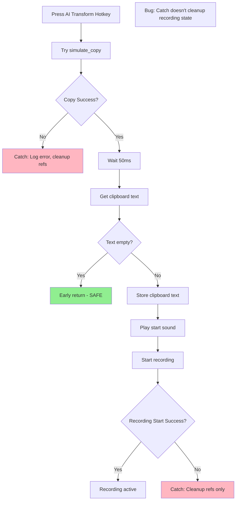

# Bug #06: Clipboard Error Handling

**Bug ID:** BUG-006  
**Date Identified:** December 14, 2025  
**Priority:** Low 🟢  
**Severity:** Low - Rare edge case  
**Status:** Open  
**Estimated Fix Time:** 30 minutes  

---

## Affected Files

- [`src/App.tsx`](../../src/App.tsx) - Lines 239-270 (AI Transform Press handler)

---

## Description

In the AI Transform feature's "Press" handler, when clipboard copy fails or returns empty text, the function returns early (line 250) but doesn't prevent the recording from starting at line 262. This creates a potential edge case where recording starts even though there's no text to transform, leading to wasted transcription API calls and confusing user experience.

### User-Facing Impact

- Rare edge case: User presses AI Transform hotkey with no text selected
- Recording starts and overlay appears
- User speaks a transformation instruction
- Transcription happens (wastes API credits)
- Transform fails because there's no input text
- Confusing error message or no feedback
- Minor inconvenience, but poor UX

---

## Root Cause Analysis

### Technical Explanation

The AI Transform flow on hotkey press:

```typescript:src/App.tsx
if (event.state === "Pressed") {
  // Auto-copy: simulate Ctrl+C to copy selected text first
  try {
    console.log("AI Transform: copying selected text...");
    await invoke("simulate_copy");

    // Small delay to let clipboard update
    await new Promise((resolve) => setTimeout(resolve, 50));

    // Now grab clipboard text
    const clipboardText = await invoke<string>("get_clipboard_text");
    if (!clipboardText || clipboardText.trim() === "") {
      console.log("No text selected/copied for AI Transform");
      return;  // ← Early return, but recording hasn't started yet (safe)
    }
    aiTransformClipboardText.current = clipboardText;
    aiTransformStartTime.current = Date.now();
    console.log(`AI Transform: captured ${clipboardText.length} chars from selection`);

    // Play start sound
    if (state.settings.audioEnabled) {
      invoke("play_sound", { soundType: "start" }).catch(console.error);
    }

    // Start recording the voice instruction  ← Line 262
    await invoke("start_recording");
    useAppStore.getState().startRecording();
    invoke("show_recording_overlay").catch(console.error);
    console.log("AI Transform: recording voice instruction...");
  } catch (error) {
    console.error("Failed to start AI Transform:", error);
    aiTransformClipboardText.current = "";
    aiTransformStartTime.current = 0;
  }
}
```

**The Issue:**
The early return at line 250 happens BEFORE recording starts, so it's actually safe. However, the catch block (lines 267-270) doesn't clean up if recording has started but then fails.

**Corrected Analysis:**
Actually, looking more carefully:
1. If clipboard is empty → return early (line 250) → recording never starts ✅ OK
2. If clipboard copy succeeds but recording fails → catch block → cleans up refs but NOT recording state ❌ BUG

The real bug is in the catch block: if an error occurs after `aiTransformClipboardText.current` is set but before/during recording start, the refs are cleaned but the recording state might not be.

### Code Flow Diagram



### Why This Is Problematic (Minor)

1. **Incomplete Cleanup:** Error handler doesn't reset recording state
2. **Edge Case:** Only happens if recording start fails (rare)
3. **User Confusion:** App might be in inconsistent state after error
4. **Resource Leak:** Recording might be partially started
5. **Not Critical:** Rare occurrence, user can recover by pressing hotkey again

---

## Reproduction Steps

### Prerequisites
- SpeakEasy desktop app running
- AI Transform hotkey configured
- Ability to simulate clipboard/recording failures (test environment)

### Steps to Reproduce (Simulated)

This is hard to reproduce in normal conditions. Would need to:

1. Mock the `invoke` function to fail at specific points
2. Press AI Transform hotkey with text selected
3. Simulate failure during `start_recording` call
4. Observe app state

**Expected Behavior:**
- Error logged
- Clean state (idle)
- Can try again

**Actual Behavior:**
- Error logged
- Refs cleaned but state might be inconsistent
- Might need app restart in worst case

### Real-World Conditions That Could Trigger This

- Backend crash during recording start
- Permission denial for microphone access
- System audio device disconnected mid-operation
- Race condition with another recording starting

---

## Proposed Fix

### Solution

Add comprehensive cleanup to the catch block to handle errors at any point in the flow:

#### Before (Incomplete Cleanup)
```typescript
} catch (error) {
  console.error("Failed to start AI Transform:", error);
  aiTransformClipboardText.current = "";
  aiTransformStartTime.current = 0;
}
```

#### After (Complete Cleanup)
```typescript
} catch (error) {
  console.error("Failed to start AI Transform:", error);
  
  // Clean up all state, regardless of where error occurred
  aiTransformClipboardText.current = "";
  aiTransformStartTime.current = 0;
  
  // Reset recording state if it was started
  const currentState = useAppStore.getState();
  if (currentState.recordingState !== "idle") {
    useAppStore.getState().setRecordingState("idle");
  }
  
  // Hide overlay if it was shown
  invoke("hide_recording_overlay").catch(console.error);
  
  // Optional: Show error toast to user
  useAppStore.getState().addTranscription({
    id: crypto.randomUUID(),
    text: `[AI Transform Error] ${error}`,
    durationMs: 0,
    language: "en",
    createdAt: new Date().toISOString(),
  });
}
```

### Complete Context with Fix

```typescript:src/App.tsx
if (event.state === "Pressed") {
  try {
    console.log("AI Transform: copying selected text...");
    await invoke("simulate_copy");

    await new Promise((resolve) => setTimeout(resolve, 50));

    const clipboardText = await invoke<string>("get_clipboard_text");
    if (!clipboardText || clipboardText.trim() === "") {
      console.log("No text selected/copied for AI Transform");
      return;
    }
    aiTransformClipboardText.current = clipboardText;
    aiTransformStartTime.current = Date.now();
    console.log(`AI Transform: captured ${clipboardText.length} chars from selection`);

    if (state.settings.audioEnabled) {
      invoke("play_sound", { soundType: "start" }).catch(console.error);
    }

    await invoke("start_recording");
    useAppStore.getState().startRecording();
    invoke("show_recording_overlay").catch(console.error);
    console.log("AI Transform: recording voice instruction...");
  } catch (error) {
    console.error("Failed to start AI Transform:", error);
    
    // Complete cleanup
    aiTransformClipboardText.current = "";
    aiTransformStartTime.current = 0;
    
    const currentState = useAppStore.getState();
    if (currentState.recordingState !== "idle") {
      useAppStore.getState().setRecordingState("idle");
    }
    
    invoke("hide_recording_overlay").catch(console.error);
    
    // Optional: notify user
    useAppStore.getState().addTranscription({
      id: crypto.randomUUID(),
      text: `[AI Transform Error] ${error}`,
      durationMs: 0,
      language: "en",
      createdAt: new Date().toISOString(),
    });
  }
}
```

### Alternative Approaches Considered

1. **Try-Catch Around Each Step:**
   ```typescript
   try { await invoke("simulate_copy"); } catch { /* cleanup */ }
   try { await invoke("start_recording"); } catch { /* cleanup */ }
   ```
   - Pros: More granular error handling
   - Cons: Lots of boilerplate, harder to read
   - Recommendation: Overkill for this use case

2. **Centralized Error Handler:**
   ```typescript
   const handleAiTransformError = (error, phase) => {
     // Cleanup based on phase
   };
   ```
   - Pros: DRY, easier to maintain
   - Cons: Adds complexity for 2-3 error sites
   - Recommendation: Good if errors become common

3. **Prevent Recording Start on Error:**
   - Check each step succeeded before starting recording
   - Pros: Never starts recording if prerequisites fail
   - Cons: Already basically what happens, except for error during start
   - Recommendation: Current flow is fine with better cleanup

**Recommended:** Fix #1 (complete cleanup in catch) - thorough and simple

---

## Testing Plan

### Unit Tests

Create test file: `src/__tests__/App.aiTransformErrors.test.tsx`

```typescript
describe('AI Transform error handling', () => {
  it('should cleanup state when copy fails', async () => {
    const mockInvoke = jest.fn().mockRejectedValue(new Error('Copy failed'));
    
    await simulateAiTransformPress();
    
    // Should cleanup refs
    expect(aiTransformClipboardText.current).toBe('');
    expect(aiTransformStartTime.current).toBe(0);
    
    // Should be in idle state
    expect(store.getState().recordingState).toBe('idle');
  });

  it('should cleanup state when recording start fails', async () => {
    const mockInvoke = jest.fn()
      .mockResolvedValueOnce() // simulate_copy succeeds
      .mockResolvedValueOnce('test text') // get_clipboard_text succeeds
      .mockRejectedValueOnce(new Error('Recording failed')); // start_recording fails
    
    await simulateAiTransformPress();
    
    // Should cleanup everything
    expect(store.getState().recordingState).toBe('idle');
    expect(mockInvoke).toHaveBeenCalledWith('hide_recording_overlay');
  });

  it('should show error message to user', async () => {
    const mockInvoke = jest.fn().mockRejectedValue(new Error('Test error'));
    
    await simulateAiTransformPress();
    
    // Should add error to history
    const history = store.getState().history;
    expect(history[0].text).toContain('[AI Transform Error]');
  });
});
```

### Integration Tests

```typescript
describe('AI Transform error recovery', () => {
  it('should allow retry after error', async () => {
    // First attempt fails
    mockInvoke.mockRejectedValueOnce(new Error('Failed'));
    await simulateAiTransformPress();
    
    // Second attempt succeeds
    mockInvoke.mockResolvedValue('success');
    await simulateAiTransformPress();
    await simulateAiTransformRelease();
    
    // Should complete successfully
    expect(screen.getByText('Transformed text')).toBeInTheDocument();
  });

  it('should not block other features after error', async () => {
    // AI Transform fails
    await simulateAiTransformPressWithError();
    
    // Regular recording should still work
    await simulateRegularRecording();
    expect(screen.getByText('Transcription')).toBeInTheDocument();
  });
});
```

### Manual Testing Checklist

- [ ] Test normal AI Transform flow (should work)
- [ ] Simulate microphone permission denial
- [ ] Verify error message appears in history
- [ ] Verify can use AI Transform again after error
- [ ] Test with no text selected (early return path)
- [ ] Test with clipboard access denied
- [ ] Verify overlay doesn't stay visible after error
- [ ] Test regular recording after AI Transform error
- [ ] Check console for error logs

### Edge Cases to Verify

1. **No Text Selected:** Should return early, no recording
2. **Copy Fails:** Should cleanup, show error
3. **Recording Start Fails:** Should cleanup, show error
4. **Overlay Already Hidden:** Should not error on second hide
5. **Rapid Repeated Errors:** Should cleanup each time

---

## Related Context

### Transform Feature Plan

From [`TRANSFORM_FEATURE_PLAN.md`](../../TRANSFORM_FEATURE_PLAN.md):

The AI Transform feature doesn't specify error handling patterns. Should be updated to include error recovery requirements.

### Lessons Learned References

No previous documentation in [`lessons-learned/`](../../lessons-learned/) about error handling patterns. Consider documenting after fix.

### SRS Requirements

From [`speakeasy-srs.md`](../../speakeasy-srs.md):

**NFR-R004: Error Recovery**
> Auto-retry failed transcriptions

**NFR-R005: Crash Recovery**
> App restarts and recovers state

This bug relates to error recovery - ensuring clean state after failures.

### Related Bugs

- **Bug #03 (AI Transform Cleanup Missing):** Similar cleanup pattern issue
- Both should be fixed with consistent error handling approach

---

## Implementation Checklist

- [ ] Update catch block at line 267-270
- [ ] Add recording state cleanup
- [ ] Add overlay hide call
- [ ] Add error notification to history
- [ ] Test with simulated failures
- [ ] Add unit tests for error paths
- [ ] Add integration tests for recovery
- [ ] Verify no console errors on error paths
- [ ] Document error handling pattern

---

## Post-Fix Validation

### Success Criteria

1. ✅ All errors cleanup state completely
2. ✅ User sees error notification
3. ✅ Can retry AI Transform after error
4. ✅ Other features work after error
5. ✅ No lingering visual artifacts
6. ✅ Unit and integration tests pass

### Error Recovery Checklist

- [ ] Refs cleaned (clipboardText, startTime)
- [ ] State reset to idle
- [ ] Overlay hidden
- [ ] User notified of error
- [ ] Can use feature again immediately

### Rollback Plan

If the fix causes issues:
1. Revert catch block changes
2. Keep minimal cleanup (refs only)
3. Document known limitation
4. Consider more invasive refactor later

---

## Additional Notes

### Error Handling Best Practices

**General pattern for async operations with state:**

```typescript
// Setup
let resourceAcquired = false;
let stateChanged = false;

try {
  // Acquire resource
  await acquireResource();
  resourceAcquired = true;
  
  // Change state
  updateState();
  stateChanged = true;
  
  // Perform operation
  await performOperation();
  
} catch (error) {
  console.error('Operation failed:', error);
  
  // Cleanup in reverse order
  if (stateChanged) {
    revertState();
  }
  if (resourceAcquired) {
    releaseResource();
  }
  
  // Notify user
  showError(error);
}
```

Consider adding this pattern to team coding standards.

### Future Enhancement

Consider adding a more robust error recovery system:
- Error boundary component
- Global error handler
- Automatic retry for transient errors
- Better user feedback (toast notifications)
- Error telemetry for debugging

---

**Discovered By:** Code review analysis  
**Verified By:** [Pending]  
**Fixed By:** [Pending]  
**Fix Date:** [Pending]  

**Note:** While this is a low-priority bug (rare edge case), it's good practice to have complete error handling
