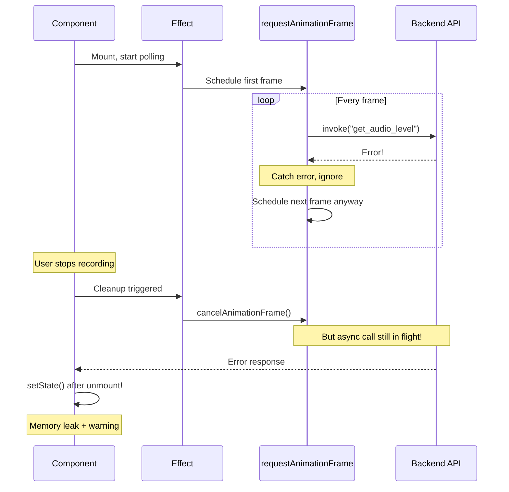

# Bug #07: Recording Indicator Memory Leak

**Bug ID:** BUG-007  
**Date Identified:** December 14, 2025  
**Priority:** Low 🟢  
**Severity:** Low - Only affects long recording sessions  
**Status:** Open  
**Estimated Fix Time:** 1 hour  

---

## Affected Files

- [`src/components/RecordingIndicator.tsx`](../../src/components/RecordingIndicator.tsx) - Lines 10-43

---

## Description

The `RecordingIndicator` component uses `requestAnimationFrame` in a recursive pattern to poll audio levels at ~30fps. If errors occur repeatedly during polling, the animation frame continues to be scheduled even after the component unmounts, potentially causing memory leaks and unnecessary CPU usage. The async function inside `requestAnimationFrame` may also cause timing issues if the promise takes longer than the frame rate to resolve.

### User-Facing Impact

- Minimal under normal conditions
- During long recording sessions with intermittent errors, memory usage may slowly increase
- CPU usage may remain elevated after recording stops
- Battery drain on laptops during extended use
- Very unlikely to be noticed by users, but poor practice

---

## Root Cause Analysis

### Technical Explanation

The component's recording indicator uses a polling pattern:

```typescript:src/components/RecordingIndicator.tsx
useEffect(() => {
  if (recordingState === "recording") {
    // Poll audio level at ~30fps
    const pollLevel = async () => {
      try {
        const level = await invoke<number>("get_audio_level");

        // Update waveform history
        setWaveformHistory((prev) => {
          const next = [...prev.slice(1), level];
          return next;
        });
      } catch (_e) {
        // Ignore errors  ← Problem: Still schedules next frame even after error
      }
      animationRef.current = requestAnimationFrame(pollLevel);  // ← Schedules regardless
    };

    pollLevel();
  } else {
    // Reset when not recording
    setWaveformHistory(Array(20).fill(0));
    if (animationRef.current) {
      cancelAnimationFrame(animationRef.current);
      animationRef.current = null;
    }
  }

  return () => {
    if (animationRef.current) {
      cancelAnimationFrame(animationRef.current);
    }
  };
}, [recordingState]);
```

### Problems

1. **No Mount Check:** After unmount, async operations may still complete and call `setState`
2. **Error Resilience:** Errors are caught but frame continues scheduling
3. **Async in rAF:** Promise resolution timing may not align with frame rate
4. **Cleanup Race:** Cleanup may run while async operation is in flight

### Memory Leak Scenario



### Why This Is Problematic

1. **Memory Leak:** setState after unmount retains component in memory
2. **CPU Waste:** Animation frames continue after component is gone
3. **Resource Drain:** Repeated API calls that aren't needed
4. **Console Warnings:** React warns about setState on unmounted component
5. **Battery Impact:** Unnecessary CPU usage drains laptop batteries

---

## Reproduction Steps

### Prerequisites
- SpeakEasy desktop app running
- Recording active for extended period
- Intermittent backend errors (can be simulated)

### Steps to Reproduce (with monitoring)

1. Open Chrome DevTools → Memory tab
2. Take heap snapshot
3. Start recording
4. Let it run for 5-10 minutes
5. Stop recording
6. Navigate away from the indicator
7. Take another heap snapshot
8. Compare - look for detached RecordingIndicator instances

**Expected Behavior:**
- Component fully unmounts
- No lingering animation frames
- Memory released

**Actual Behavior:**
- May have lingering async operations
- Animation frames may continue briefly
- Small memory retention (minor leak)

### Conditions That Exacerbate

- Backend errors during audio level polling
- Very long recording sessions (>10 minutes)
- Rapid component mount/unmount cycles
- Slow backend responses (async call outlives component)

---

## Proposed Fix

### Solution

Use an `isMounted` flag to prevent state updates and animation scheduling after component unmounts:

#### Before (Potential Leak)
```typescript
useEffect(() => {
  if (recordingState === "recording") {
    const pollLevel = async () => {
      try {
        const level = await invoke<number>("get_audio_level");
        setWaveformHistory((prev) => {
          const next = [...prev.slice(1), level];
          return next;
        });
      } catch (_e) {
        // Ignore errors
      }
      animationRef.current = requestAnimationFrame(pollLevel);
    };

    pollLevel();
  } else {
    setWaveformHistory(Array(20).fill(0));
    if (animationRef.current) {
      cancelAnimationFrame(animationRef.current);
      animationRef.current = null;
    }
  }

  return () => {
    if (animationRef.current) {
      cancelAnimationFrame(animationRef.current);
    }
  };
}, [recordingState]);
```

#### After (Safe)
```typescript
useEffect(() => {
  let isMounted = true;  // ← Track mount status
  
  if (recordingState === "recording") {
    const pollLevel = async () => {
      if (!isMounted) return;  // ← Guard: don't continue if unmounted
      
      try {
        const level = await invoke<number>("get_audio_level");
        if (isMounted) {  // ← Guard: don't update state if unmounted
          setWaveformHistory((prev) => [...prev.slice(1), level]);
        }
      } catch (_e) {
        // Ignore errors
      }
      
      if (isMounted) {  // ← Guard: don't schedule if unmounted
        animationRef.current = requestAnimationFrame(pollLevel);
      }
    };

    pollLevel();
  } else {
    setWaveformHistory(Array(20).fill(0));
    if (animationRef.current) {
      cancelAnimationFrame(animationRef.current);
      animationRef.current = null;
    }
  }

  return () => {
    isMounted = false;  // ← Mark as unmounted
    if (animationRef.current) {
      cancelAnimationFrame(animationRef.current);
      animationRef.current = null;  // ← Clear ref
    }
  };
}, [recordingState]);
```

### Complete Fixed Code

```typescript:src/components/RecordingIndicator.tsx
import { useEffect, useState, useRef } from "react";
import { invoke } from "@tauri-apps/api/core";
import { useAppStore } from "../stores/appStore";

export default function RecordingIndicator() {
  const recordingState = useAppStore((state) => state.recordingState);
  const [waveformHistory, setWaveformHistory] = useState<number[]>(Array(20).fill(0));
  const animationRef = useRef<number | null>(null);

  useEffect(() => {
    let isMounted = true;
    
    if (recordingState === "recording") {
      // Poll audio level at ~30fps
      const pollLevel = async () => {
        if (!isMounted) return;
        
        try {
          const level = await invoke<number>("get_audio_level");

          // Update waveform history
          if (isMounted) {
            setWaveformHistory((prev) => {
              const next = [...prev.slice(1), level];
              return next;
            });
          }
        } catch (_e) {
          // Ignore errors
        }
        
        if (isMounted) {
          animationRef.current = requestAnimationFrame(pollLevel);
        }
      };

      pollLevel();
    } else {
      // Reset when not recording
      setWaveformHistory(Array(20).fill(0));
      if (animationRef.current) {
        cancelAnimationFrame(animationRef.current);
        animationRef.current = null;
      }
    }

    return () => {
      isMounted = false;
      if (animationRef.current) {
        cancelAnimationFrame(animationRef.current);
        animationRef.current = null;
      }
    };
  }, [recordingState]);

  // Don't show if not recording
  if (recordingState !== "recording") {
    return null;
  }

  return (
    <div className="fixed bottom-4 right-4 z-50">
      <div className="bg-red-500 rounded-xl shadow-2xl px-4 py-3 flex items-center gap-3 animate-pulse-subtle">
        {/* Recording dot */}
        <div className="relative">
          <div className="w-3 h-3 bg-white rounded-full" />
          <div className="absolute inset-0 w-3 h-3 bg-white rounded-full animate-ping opacity-75" />
        </div>

        {/* Waveform visualization */}
        <div className="flex items-center gap-0.5 h-8">
          {waveformHistory.map((level, i) => (
            <div
              key={i}
              className="w-1 bg-white/90 rounded-full transition-all duration-75"
              style={{
                height: `${Math.max(4, level * 32)}px`,
                opacity: 0.5 + (i / waveformHistory.length) * 0.5,
              }}
            />
          ))}
        </div>

        {/* Recording text */}
        <span className="text-white text-sm font-medium ml-1">REC</span>
      </div>
    </div>
  );
}
```

### Alternative Approaches Considered

1. **AbortController:**
   ```typescript
   const abortController = new AbortController();
   // Pass signal to invoke calls
   ```
   - Pros: Native browser API, cancels in-flight requests
   - Cons: Tauri invoke may not support AbortSignal
   - Recommendation: Check Tauri docs, use if supported

2. **Cleanup Function in async:**
   ```typescript
   const cleanup = () => { /* ... */ };
   pollLevel().finally(cleanup);
   ```
   - Pros: Ensures cleanup runs
   - Cons: Doesn't prevent setState after unmount
   - Recommendation: Not sufficient alone

3. **setInterval Instead of rAF:**
   ```typescript
   const interval = setInterval(pollLevel, 33); // ~30fps
   ```
   - Pros: Simpler, automatic timing
   - Cons: Not synced with browser rendering, less efficient
   - Recommendation: rAF is better for animations, keep with fix

**Recommended:** Fix #1 (isMounted flag) - standard React pattern, proven solution

---

## Testing Plan

### Unit Tests

Create test file: `src/components/__tests__/RecordingIndicator.test.tsx`

```typescript
describe('RecordingIndicator memory management', () => {
  beforeEach(() => {
    jest.useFakeTimers();
  });

  afterEach(() => {
    jest.useRealTimers();
  });

  it('should not update state after unmount', async () => {
    const mockInvoke = jest.fn().mockResolvedValue(0.5);
    
    const { unmount } = render(<RecordingIndicator />);
    
    // Start polling
    act(() => {
      jest.advanceTimersByTime(100);
    });
    
    // Unmount while async call in flight
    unmount();
    
    // Wait for async call to resolve
    await waitFor(() => {
      // Should not call setState (no error in console)
      expect(console.error).not.toHaveBeenCalled();
    });
  });

  it('should cancel animation frame on unmount', () => {
    const cancelSpy = jest.spyOn(window, 'cancelAnimationFrame');
    
    const { unmount } = render(<RecordingIndicator />);
    
    unmount();
    
    expect(cancelSpy).toHaveBeenCalled();
  });

  it('should stop polling when recording stops', () => {
    const mockInvoke = jest.fn().mockResolvedValue(0.5);
    
    const { rerender } = render(
      <RecordingIndicator recordingState="recording" />
    );
    
    // Recording active - should poll
    act(() => {
      jest.advanceTimersByTime(100);
    });
    expect(mockInvoke).toHaveBeenCalled();
    
    // Stop recording
    rerender(<RecordingIndicator recordingState="idle" />);
    
    mockInvoke.mockClear();
    
    // Should not poll anymore
    act(() => {
      jest.advanceTimersByTime(100);
    });
    expect(mockInvoke).not.toHaveBeenCalled();
  });
});
```

### Memory Leak Tests

```typescript
describe('RecordingIndicator memory leaks', () => {
  it('should not retain component after unmount', async () => {
    const component = render(<RecordingIndicator />);
    
    // Create weak reference
    const weakRef = new WeakRef(component.container.firstChild);
    
    // Unmount
    component.unmount();
    
    // Force garbage collection (if available in test env)
    if (global.gc) {
      global.gc();
    }
    
    // Wait for GC
    await new Promise(resolve => setTimeout(resolve, 100));
    
    // Should be collected
    expect(weakRef.deref()).toBeUndefined();
  });
});
```

### Integration Tests

```typescript
describe('RecordingIndicator integration', () => {
  it('should handle rapid mount/unmount cycles', async () => {
    for (let i = 0; i < 10; i++) {
      const { unmount } = render(<RecordingIndicator />);
      await waitFor(() => {
        expect(screen.getByText('REC')).toBeInTheDocument();
      });
      unmount();
    }
    
    // Should not accumulate memory or animation frames
    // (Would need memory profiler to verify definitively)
  });

  it('should handle long recording sessions', async () => {
    render(<RecordingIndicator />);
    
    // Simulate 10 minutes of recording
    for (let i = 0; i < 600; i++) {
      act(() => {
        jest.advanceTimersByTime(1000); // 1 second
      });
    }
    
    // Should still be responsive
    expect(screen.getByText('REC')).toBeInTheDocument();
  });
});
```

### Manual Testing Checklist

- [ ] Start recording → Indicator appears
- [ ] Watch waveform animation for 5 minutes
- [ ] Stop recording → Indicator disappears
- [ ] Check browser task manager → Memory stable
- [ ] Repeat 10 times → No memory growth
- [ ] Check console → No React warnings
- [ ] Monitor CPU usage → Returns to baseline after stop
- [ ] Test with backend errors → No crashes
- [ ] Open DevTools Memory Profiler → No detached components

### Edge Cases to Verify

1. **Unmount During API Call:** No setState after unmount
2. **Backend Error During Recording:** Continues gracefully
3. **Very Long Recording (>30 minutes):** No memory growth
4. **Rapid Start/Stop:** No leaked animation frames
5. **Component Remount:** Fresh state, no stale data

---

## Related Context

### React Best Practices

From React documentation:
> Always check if your component is still mounted before calling setState in async callbacks

> Use cleanup functions in useEffect to cancel subscriptions and timers

This bug violates these best practices by not checking mount status before setState.

### Lessons Learned References

No previous documentation in [`lessons-learned/`](../../lessons-learned/) about memory management patterns. Consider adding general async cleanup guidelines.

### SRS Requirements

From [`speakeasy-srs.md`](../../speakeasy-srs.md):

**NFR-P005: Memory Usage (recording)**
> <300MB RAM

**NFR-R005: Crash Recovery**
> App restarts and recovers state

Memory leaks violate these requirements by slowly increasing RAM usage over time.

### Related Bugs

- **Bug #04 (Recording Overlay Race Condition):** Also involves polling patterns
- Both should document proper async cleanup patterns

---

## Implementation Checklist

- [ ] Add isMounted flag to useEffect
- [ ] Add mount checks before setState
- [ ] Add mount check before scheduling rAF
- [ ] Set isMounted = false in cleanup
- [ ] Clear animationRef in cleanup
- [ ] Add unit tests for unmount safety
- [ ] Add memory leak tests (if possible)
- [ ] Manual test with memory profiler
- [ ] Verify no React warnings
- [ ] Document pattern in team standards

---

## Post-Fix Validation

### Success Criteria

1. ✅ No setState after unmount warnings
2. ✅ Memory usage stable over long recordings
3. ✅ CPU returns to baseline after stop
4. ✅ No detached components in memory profiler
5. ✅ Animation frames properly cancelled
6. ✅ Unit tests pass
7. ✅ No console errors or warnings

### Memory Profile Checklist

Before fix:
- [ ] Measure baseline memory usage
- [ ] Record for 10 minutes
- [ ] Stop and wait 1 minute
- [ ] Take memory snapshot
- [ ] Check for RecordingIndicator instances

After fix:
- [ ] Repeat same test
- [ ] Verify no retained components
- [ ] Verify memory returns to baseline
- [ ] Verify no growing heap

### Rollback Plan

If the fix causes issues:
1. Revert isMounted flag changes
2. Keep rAF cancellation in cleanup
3. Accept minor leak as known limitation
4. Document workaround (restart app periodically)

---

## Additional Notes

### isMounted Pattern

This is a standard React pattern for async operations:

```typescript
useEffect(() => {
  let isMounted = true;
  
  async function fetchData() {
    const data = await api.fetch();
    if (isMounted) {
      setState(data);  // Safe
    }
  }
  
  fetchData();
  
  return () => {
    isMounted = false;  // Prevent setState after unmount
  };
}, []);
```

**Why not use a ref?**
- Refs persist across renders, we want per-effect tracking
- Local variable is simpler and clearer
- No need for .current access

**Alternative: AbortController (modern approach):**
```typescript
useEffect(() => {
  const controller = new AbortController();
  
  async function fetchData() {
    try {
      const data = await api.fetch({ signal: controller.signal });
      setState(data);
    } catch (error) {
      if (error.name === 'AbortError') return;
      throw error;
    }
  }
  
  fetchData();
  
  return () => controller.abort();
}, []);
```

### requestAnimationFrame Best Practices

For animation loops with async operations:

1. **Check mount status before scheduling:**
   ```typescript
   if (isMounted) {
     rafId = requestAnimationFrame(loop);
   }
   ```

2. **Always cancel in cleanup:**
   ```typescript
   return () => {
     if (rafId) cancelAnimationFrame(rafId);
   };
   ```

3. **Handle async timing:**
   ```typescript
   // Async call may outlive frame duration
   // Always check mount before setState
   ```

4. **Consider throttling:**
   ```typescript
   // Don't poll faster than backend can respond
   // Add min delay between calls
   ```

---

**Discovered By:** Code review analysis  
**Verified By:** [Pending]  
**Fixed By:** [Pending]  
**Fix Date:** [Pending]  

**Impact:** Minor but good practice. Prevents potential issues in edge cases and long recording sessions.
