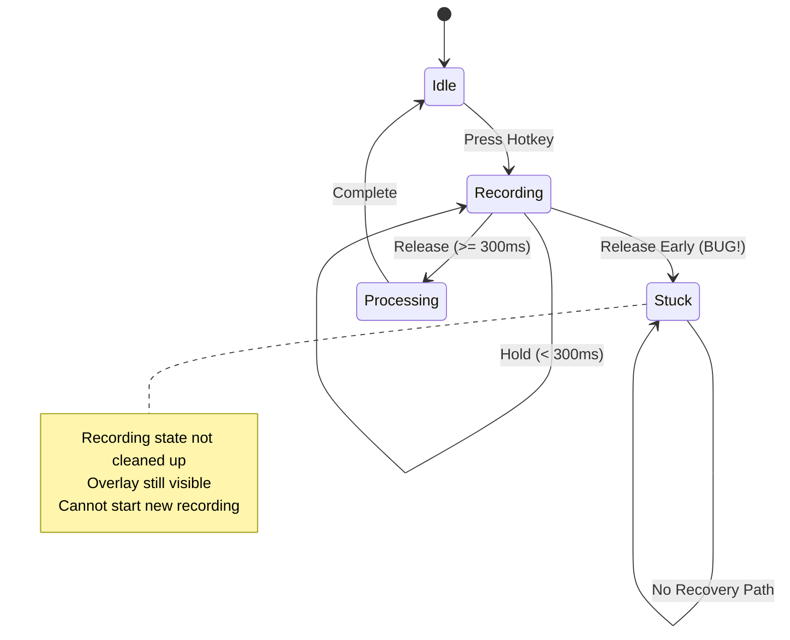

# Bug #03: AI Transform Cleanup Missing

**Bug ID:** BUG-003  
**Date Identified:** December 14, 2025  
**Priority:** Medium 🟡  
**Severity:** Medium - Degrades UX but has workarounds  
**Status:** Open  
**Estimated Fix Time:** 1 hour  

---

## Affected Files

- [`src/App.tsx`](../../src/App.tsx) - Lines 271-286 (Release event handler in AI Transform hotkey)

---

## Description

When the AI Transform hotkey is released too quickly (before `MIN_AI_TRANSFORM_RECORDING_MS` which is 300ms), the function returns early without cleaning up the recording state. This leaves the application in a "recording" state even though no recording is actually happening, causing the UI to become unresponsive and preventing future recordings.

### User-Facing Impact

- User presses AI Transform hotkey briefly → app gets stuck in "recording" mode
- Recording overlay stays visible indefinitely
- Cannot start new recordings until app restart
- Keyboard shortcuts become unresponsive
- Poor user experience with accidental quick key presses
- No clear way to recover except restarting the application

---

## Root Cause Analysis

### Technical Explanation

The AI Transform feature uses a "press-and-hold" pattern:
1. **Press:** Grab clipboard, start recording voice instruction
2. **Hold:** Record the voice instruction
3. **Release:** Stop recording, transcribe, transform, paste

To prevent accidental triggers from key bounce or very brief presses, there's a minimum recording time check at line 283-287:

```typescript:src/App.tsx
const recordingDurationMs = Date.now() - aiTransformStartTime.current;
if (recordingDurationMs < MIN_AI_TRANSFORM_RECORDING_MS) {
  console.log(`AI Transform: ignoring early release (${recordingDurationMs}ms < ${MIN_AI_TRANSFORM_RECORDING_MS}ms)`);
  return;  // ← Early return without cleanup!
}
```

The problem is that by this point in the code:
- Recording has already started (line 262: `await invoke("start_recording")`)
- App state is set to "recording" (line 263: `useAppStore.getState().startRecording()`)
- Recording overlay is visible (line 264: `invoke("show_recording_overlay")`)

When the early return happens, none of this is cleaned up, leaving the app in an inconsistent state.

### State Machine Diagram



### Current Code Flow (Buggy)

```typescript:src/App.tsx
} else if (event.state === "Released") {
  // Only process if we have clipboard text captured
  if (!aiTransformClipboardText.current) {
    return;  // ✓ OK - nothing started yet
  }

  const currentState = useAppStore.getState();
  if (currentState.recordingState !== "recording") {
    return;  // ✓ OK - not in recording state
  }

  // Check minimum recording time to prevent immediate stop from key bounce
  const recordingDurationMs = Date.now() - aiTransformStartTime.current;
  if (recordingDurationMs < MIN_AI_TRANSFORM_RECORDING_MS) {
    console.log(`AI Transform: ignoring early release (${recordingDurationMs}ms < ${MIN_AI_TRANSFORM_RECORDING_MS}ms)`);
    return;  // ❌ BUG - Recording state not cleaned up!
  }

  // ... rest of normal processing ...
}
```

### Why This Is Problematic

1. **State Inconsistency:** App thinks it's recording but backend is not
2. **UI Freeze:** Recording overlay blocks interaction
3. **No Recovery:** User must restart app to fix
4. **Confusing UX:** No feedback about what went wrong
5. **Keyboard Lock:** Global hotkeys may be unresponsive

---

## Reproduction Steps

### Prerequisites
- SpeakEasy desktop app running
- AI Transform hotkey configured (default: Ctrl+`)
- Some text selected in any application

### Steps to Reproduce

1. Select some text in any text editor
2. Press and IMMEDIATELY release the AI Transform hotkey (Ctrl+`)
   - Must release within 300ms (very quick tap)
3. Observe the recording overlay appears briefly
4. Overlay remains visible indefinitely
5. Try to use the recording hotkey (Ctrl+Space)
6. Notice it doesn't work

**Expected Behavior:** 
- Early release is ignored
- UI returns to idle state
- Can use hotkeys normally

**Actual Behavior:**
- Recording overlay stays visible
- App is stuck in "recording" state
- Cannot start new recordings
- Must restart app

### Timing Requirements

- Release must happen between ~10ms and 300ms after press
- Too fast (< 10ms): Might not register the press at all
- Too slow (> 300ms): Works correctly

---

## Proposed Fix

### Solution

Add proper cleanup before the early return at line 286. The cleanup should mirror what happens in other error/abort scenarios.

#### Before (Buggy)
```typescript
const recordingDurationMs = Date.now() - aiTransformStartTime.current;
if (recordingDurationMs < MIN_AI_TRANSFORM_RECORDING_MS) {
  console.log(`AI Transform: ignoring early release (${recordingDurationMs}ms < ${MIN_AI_TRANSFORM_RECORDING_MS}ms)`);
  return;  // ← No cleanup!
}
```

#### After (Fixed)
```typescript
const recordingDurationMs = Date.now() - aiTransformStartTime.current;
if (recordingDurationMs < MIN_AI_TRANSFORM_RECORDING_MS) {
  console.log(`AI Transform: ignoring early release (${recordingDurationMs}ms < ${MIN_AI_TRANSFORM_RECORDING_MS}ms)`);
  
  // Clean up state before returning
  aiTransformClipboardText.current = "";
  aiTransformStartTime.current = 0;
  useAppStore.getState().setRecordingState("idle");
  invoke("hide_recording_overlay").catch(console.error);
  
  return;
}
```

### Complete Context with Fix

```typescript:src/App.tsx
} else if (event.state === "Released") {
  // Only process if we have clipboard text captured
  if (!aiTransformClipboardText.current) {
    return;
  }

  const currentState = useAppStore.getState();
  if (currentState.recordingState !== "recording") {
    return;
  }

  // Check minimum recording time to prevent immediate stop from key bounce
  const recordingDurationMs = Date.now() - aiTransformStartTime.current;
  if (recordingDurationMs < MIN_AI_TRANSFORM_RECORDING_MS) {
    console.log(`AI Transform: ignoring early release (${recordingDurationMs}ms < ${MIN_AI_TRANSFORM_RECORDING_MS}ms)`);
    
    // Clean up state before returning
    aiTransformClipboardText.current = "";
    aiTransformStartTime.current = 0;
    useAppStore.getState().setRecordingState("idle");
    invoke("hide_recording_overlay").catch(console.error);
    
    return;
  }

  // Play stop sound
  if (currentState.settings.audioEnabled) {
    invoke("play_sound", { soundType: "stop" }).catch(console.error);
  }

  // ... rest of the normal flow continues ...
```

### Alternative Approaches Considered

1. **Prevent Recording Start Until Minimum Time:**
   ```typescript
   // Don't start recording immediately on press
   // Wait for MIN_AI_TRANSFORM_RECORDING_MS first
   ```
   - Pros: Prevents the issue entirely
   - Cons: Adds perceived latency, poor UX
   - Recommendation: Not preferred, users expect immediate feedback

2. **Centralized Cleanup Function:**
   ```typescript
   const cleanupAiTransform = () => {
     aiTransformClipboardText.current = "";
     aiTransformStartTime.current = 0;
     useAppStore.getState().setRecordingState("idle");
     invoke("hide_recording_overlay").catch(console.error);
   };
   ```
   - Pros: DRY, easier to maintain
   - Cons: Adds complexity for a pattern used in ~3 places
   - Recommendation: Good for future refactor, not critical now

3. **Extend Minimum Time:**
   ```typescript
   const MIN_AI_TRANSFORM_RECORDING_MS = 500; // Increase from 300
   ```
   - Pros: Reduces accidental triggers
   - Cons: Doesn't fix the bug, just makes it less likely
   - Recommendation: Not a fix, may be done in addition

**Recommended:** Fix #1 (add cleanup before return) - directly addresses the bug

---

## Testing Plan

### Unit Tests

Create test file: `src/__tests__/App.aiTransform.test.tsx`

```typescript
describe('AI Transform early release handling', () => {
  it('should clean up state when released early', async () => {
    // Arrange
    const mockStore = createMockStore({ recordingState: 'idle' });
    const mockInvoke = jest.fn();
    
    // Act
    // Simulate press (starts recording)
    await simulateHotkeyPress();
    expect(mockStore.getState().recordingState).toBe('recording');
    
    // Simulate immediate release (< 300ms)
    await sleep(100);
    await simulateHotkeyRelease();
    
    // Assert
    expect(mockStore.getState().recordingState).toBe('idle');
    expect(mockInvoke).toHaveBeenCalledWith('hide_recording_overlay');
  });

  it('should not process transcription when released early', async () => {
    const mockTranscribe = jest.fn();
    
    // Press and release quickly
    await simulateHotkeyPress();
    await sleep(100);
    await simulateHotkeyRelease();
    
    // Should not attempt transcription
    expect(mockTranscribe).not.toHaveBeenCalled();
  });

  it('should allow new recording after early release', async () => {
    // Quick press/release
    await simulateHotkeyPress();
    await sleep(100);
    await simulateHotkeyRelease();
    
    // Should be able to start new recording
    await simulateHotkeyPress();
    expect(mockStore.getState().recordingState).toBe('recording');
  });
});
```

### Integration Tests

```typescript
describe('AI Transform integration', () => {
  it('should recover gracefully from accidental quick taps', async () => {
    // User accidentally taps hotkey
    await quickTapAiTransformHotkey();
    
    // Should return to idle state
    await waitFor(() => {
      expect(screen.queryByText('REC')).not.toBeInTheDocument();
    });
    
    // Should be able to use normally afterward
    await normalAiTransformFlow();
    expect(screen.getByText('Transformed text')).toBeInTheDocument();
  });

  it('should not block other hotkeys after early release', async () => {
    // Quick tap AI Transform
    await quickTapAiTransformHotkey();
    
    // Regular recording should still work
    await pressRecordingHotkey();
    expect(screen.getByText('REC')).toBeInTheDocument();
  });
});
```

### Manual Testing Checklist

- [ ] Select text in editor
- [ ] Very quick tap (<100ms) of AI Transform hotkey
- [ ] Verify overlay disappears
- [ ] Verify can start new recording immediately
- [ ] Quick tap (100-299ms) of AI Transform hotkey
- [ ] Verify same cleanup behavior
- [ ] Normal AI Transform (>300ms) still works
- [ ] Test with rapid repeated quick taps
- [ ] Verify no memory leaks from repeated cleanup
- [ ] Test with audio feedback enabled and disabled
- [ ] Check console for proper log messages

### Edge Cases to Verify

1. **Very Rapid Repeated Taps:** Cleanup should work multiple times
2. **Quick Tap During Normal Recording:** Should not interfere
3. **Quick Tap With No Text Selected:** Should not start recording at all
4. **Network Error During Quick Tap:** Cleanup should still work
5. **Overlay Already Hidden:** Second hide call should not error

---

## Related Context

### Transform Feature Plan

From [`TRANSFORM_FEATURE_PLAN.md`](../../TRANSFORM_FEATURE_PLAN.md):

The AI Transform feature is documented with the press-and-hold pattern, but cleanup handling for edge cases is not specified. The plan should be updated to document state management requirements.

### Lessons Learned References

No previous documentation in [`lessons-learned/`](../../lessons-learned/) about state cleanup patterns. Consider documenting this pattern after fix.

### SRS Requirements

From [`speakeasy-srs.md`](../../speakeasy-srs.md):

**NFR-R005: Crash Recovery**
> App restarts and recovers state

This bug violates graceful state recovery since the app gets stuck without a recovery path.

### Related Bugs

- **Bug #06 (Clipboard Error Handling):** Similar pattern of missing cleanup on early returns
- Both should be fixed with consistent cleanup patterns

---

## Implementation Checklist

- [ ] Add cleanup code before early return (line 286)
- [ ] Add code comment explaining why cleanup is needed
- [ ] Test quick tap behavior manually
- [ ] Verify overlay disappears
- [ ] Verify state resets to idle
- [ ] Add unit tests for early release
- [ ] Add integration tests for recovery
- [ ] Test with audio feedback on/off
- [ ] Verify no console errors
- [ ] Update Transform Feature Plan with state management notes

---

## Post-Fix Validation

### Success Criteria

1. ✅ Quick tap (<300ms) of AI Transform hotkey cleans up properly
2. ✅ Overlay disappears after early release
3. ✅ App returns to idle state
4. ✅ Can start new recording immediately after
5. ✅ No console errors or warnings
6. ✅ Other hotkeys remain functional
7. ✅ Unit and integration tests pass

### User Experience Checklist

- [ ] No visual artifacts after quick tap
- [ ] Immediate feedback (overlay appears/disappears quickly)
- [ ] No perceived "stuck" state
- [ ] Can recover without app restart
- [ ] Behavior is predictable and consistent

### Rollback Plan

If the fix causes issues:
1. Revert cleanup code
2. Increase MIN_AI_TRANSFORM_RECORDING_MS to 500ms
3. Add documentation about minimum press duration
4. Consider alternative UX pattern (button instead of press-and-hold)

---

## Additional Notes

### State Cleanup Pattern

This bug reveals a common pattern in the codebase: **any early return from a function that has started async operations needs cleanup**.

**General Rule:**
```typescript
// Start operation
setState('processing');
showUI();

// Check if we should continue
if (shouldAbort) {
  // ❌ BAD: return without cleanup
  return;
  
  // ✅ GOOD: cleanup before return
  setState('idle');
  hideUI();
  return;
}

// Continue normal processing...
```

Consider adding this to the team's coding standards.

### User Feedback Improvement

After fixing the bug, consider adding user feedback for early release:
- Show toast: "AI Transform cancelled (hold longer)"
- Play a "cancelled" sound (different from start/stop)
- Visual indication in the overlay

This would improve discoverability and reduce user confusion.

---

**Discovered By:** Code review analysis  
**Verified By:** [Pending]  
**Fixed By:** [Pending]  
**Fix Date:** [Pending]  

**Future Enhancement:** Consider adding visual timer to overlay showing minimum hold time
