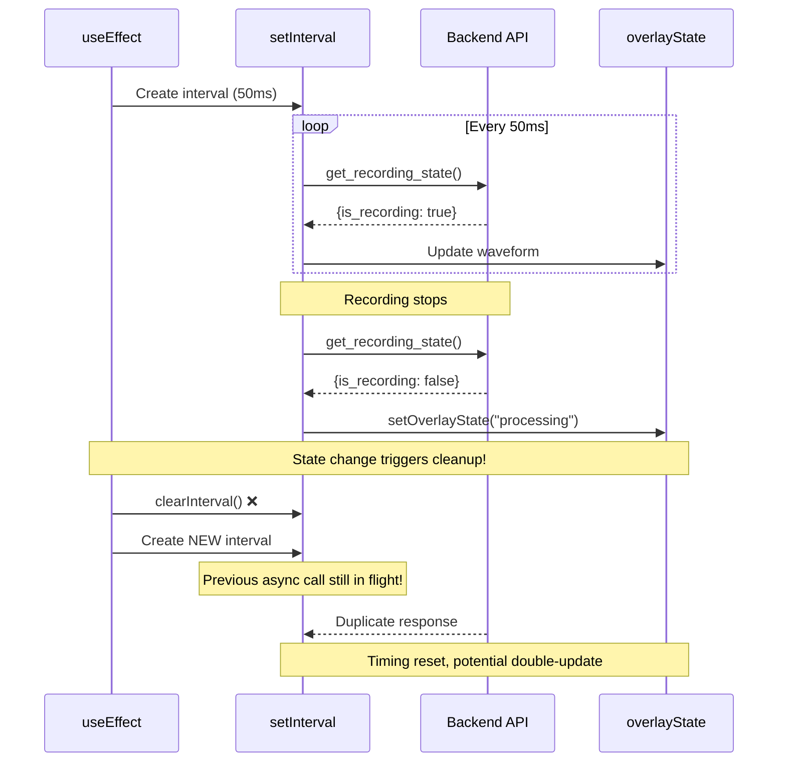

# Bug #04: Recording Overlay Race Condition

**Bug ID:** BUG-004  
**Date Identified:** December 14, 2025  
**Priority:** Medium 🟡  
**Severity:** Medium - Visual feedback may be incorrect  
**Status:** Open  
**Estimated Fix Time:** 2 hours  

---

## Affected Files

- [`src/components/RecordingOverlay.tsx`](../../src/components/RecordingOverlay.tsx) - Lines 28-61 (useEffect with overlayState dependency)

---

## Description

The recording overlay component uses a `setInterval` inside a `useEffect` that depends on `overlayState`. When the overlay state changes (e.g., from "recording" to "processing"), the effect cleanup runs, clearing the interval and immediately creating a new one. This causes timing issues, missed state transitions, and potential race conditions where the backend recording state and frontend overlay state get out of sync.

### User-Facing Impact

- Recording overlay may not update correctly
- State transitions (recording → processing) may be delayed or skipped
- Waveform animation may freeze or jump
- Processing timer may not start at the correct time
- User sees inconsistent visual feedback during recording
- Overlay might show "recording" when actually processing, or vice versa

---

## Root Cause Analysis

### Technical Explanation

The component polls the backend every 50ms to check recording state:

```typescript:src/components/RecordingOverlay.tsx
useEffect(() => {
  const interval = setInterval(async () => {
    try {
      const state = await invoke<{ is_recording: boolean }>("get_recording_state");
      
      if (state.is_recording) {
        // Update waveform, etc.
      } else if (hasSeenRecording.current && overlayState === "recording") {
        // Transition to processing
        setOverlayState("processing");  // ← This triggers the effect to re-run!
      }
    } catch (_e) {
      // Ignore errors
    }
  }, 50);

  return () => clearInterval(interval);
}, [overlayState]);  // ← Problem: effect depends on state it modifies
```

The issue is that `overlayState` is in the dependency array, so:

1. Interval starts polling at 50ms intervals
2. Backend state changes (recording stops)
3. Component detects this and calls `setOverlayState("processing")`
4. State change triggers effect cleanup (clears interval)
5. Effect immediately re-runs with new state (creates new interval)
6. New interval resets timing, may miss state transitions
7. Race condition: two async calls may be in flight

### Race Condition Diagram



### Why This Is Problematic

1. **Timing Disruption:** Interval resets when state changes, losing precision
2. **Race Conditions:** Multiple async calls in flight during transition
3. **Missed Transitions:** State may change during interval recreation
4. **Performance:** Creating/destroying intervals is wasteful
5. **Debugging:** Non-deterministic behavior hard to reproduce

---

## Reproduction Steps

### Prerequisites
- SpeakEasy desktop app running
- Recording hotkey configured
- React DevTools installed (optional, for observing effects)

### Steps to Reproduce

1. Open React DevTools and watch the RecordingOverlay component
2. Start a recording (Ctrl+Space)
3. Observe the overlay and waveform animation
4. Stop the recording
5. Watch for the transition to "processing" state
6. Observe timing of the transition

**Expected Behavior:**
- Smooth transition from recording to processing
- Processing timer starts immediately
- No visual glitches or delays

**Actual Behavior:**
- Slight delay or jump during transition
- Processing timer may start late
- Waveform may freeze briefly
- Interval creation visible in React DevTools

### Conditions That Exacerbate the Issue

- Very short recordings (state changes quickly)
- Slow backend responses (async calls overlap)
- Rapid start/stop of recordings
- High system load (timing less predictable)

---

## Proposed Fix

### Solution

Use a ref to track the current overlay state without including it in the effect dependencies. This allows the interval to access the current state without recreating when it changes.

#### Before (Buggy)
```typescript
useEffect(() => {
  const interval = setInterval(async () => {
    // ... code that checks overlayState ...
  }, 50);

  return () => clearInterval(interval);
}, [overlayState]);  // ← Causes interval recreation
```

#### After (Fixed)
```typescript
// Track overlay state in a ref for stable access
const overlayStateRef = useRef<OverlayState>("recording");

// Keep ref in sync with state
useEffect(() => {
  overlayStateRef.current = overlayState;
}, [overlayState]);

// Interval effect with empty deps - runs once
useEffect(() => {
  const interval = setInterval(async () => {
    try {
      const state = await invoke<{ is_recording: boolean }>("get_recording_state");
      
      if (state.is_recording) {
        if (!hasSeenRecording.current) {
          hasSeenRecording.current = true;
          setOverlayState("recording");
          setProcessingStartTime(null);
          setElapsedSeconds(0);
          setWaveformHistory(Array(12).fill(0.2));
        }
        const level = await invoke<number>("get_audio_level");
        setWaveformHistory((prev) => [...prev.slice(1), level]);
      } else if (hasSeenRecording.current && overlayStateRef.current === "recording") {
        // Use ref instead of state directly
        console.log("RecordingOverlay: Recording stopped, switching to processing");
        hasSeenRecording.current = false;
        setOverlayState("processing");
        setProcessingStartTime(Date.now());
        setElapsedSeconds(0);
      }
    } catch (_e) {
      // Ignore errors
    }
  }, 50);

  return () => clearInterval(interval);
}, []); // ← Empty deps - interval never recreated
```

### Complete Fixed Code

```typescript:src/components/RecordingOverlay.tsx
import { useEffect, useState, useRef } from "react";
import { invoke } from "@tauri-apps/api/core";

type OverlayState = "recording" | "processing";

export default function RecordingOverlay() {
  const [waveformHistory, setWaveformHistory] = useState<number[]>(Array(12).fill(0.2));
  const [overlayState, setOverlayState] = useState<OverlayState>("recording");
  const [processingStartTime, setProcessingStartTime] = useState<number | null>(null);
  const [elapsedSeconds, setElapsedSeconds] = useState(0);
  const hasSeenRecording = useRef(false);
  
  // Ref for stable state access in interval
  const overlayStateRef = useRef<OverlayState>("recording");
  
  // Keep ref in sync with state
  useEffect(() => {
    overlayStateRef.current = overlayState;
  }, [overlayState]);

  // Timer for processing elapsed time
  useEffect(() => {
    if (overlayState !== "processing" || !processingStartTime) {
      return;
    }

    const interval = setInterval(() => {
      setElapsedSeconds(Math.floor((Date.now() - processingStartTime) / 1000));
    }, 100);

    return () => clearInterval(interval);
  }, [overlayState, processingStartTime]);

  // Poll recording state - runs once, stable interval
  useEffect(() => {
    const interval = setInterval(async () => {
      try {
        const state = await invoke<{ is_recording: boolean }>("get_recording_state");

        if (state.is_recording) {
          if (!hasSeenRecording.current) {
            hasSeenRecording.current = true;
            setOverlayState("recording");
            setProcessingStartTime(null);
            setElapsedSeconds(0);
            setWaveformHistory(Array(12).fill(0.2));
          }
          const level = await invoke<number>("get_audio_level");
          setWaveformHistory((prev) => [...prev.slice(1), level]);
        } else if (hasSeenRecording.current && overlayStateRef.current === "recording") {
          console.log("RecordingOverlay: Recording stopped, switching to processing");
          hasSeenRecording.current = false;
          setOverlayState("processing");
          setProcessingStartTime(Date.now());
          setElapsedSeconds(0);
        }
      } catch (_e) {
        // Ignore errors
      }
    }, 50);

    return () => clearInterval(interval);
  }, []); // Empty deps - stable interval

  // ... rest of component (render logic) ...
}
```

### Alternative Approaches Considered

1. **useReducer for Complex State:**
   ```typescript
   const [state, dispatch] = useReducer(overlayReducer, initialState);
   ```
   - Pros: Centralized state management, clearer transitions
   - Cons: More boilerplate for a simple component
   - Recommendation: Good for future if state becomes more complex

2. **Separate Effects for Each State:**
   ```typescript
   // One effect for recording polling
   // Another effect for processing polling
   ```
   - Pros: Clearer separation of concerns
   - Cons: Duplicated polling logic, harder to coordinate
   - Recommendation: Not necessary, single polling loop is simpler

3. **Backend Event Stream (WebSocket):**
   ```typescript
   // Backend pushes state changes instead of polling
   ```
   - Pros: More efficient, no polling overhead, instant updates
   - Cons: Major architecture change, not needed for 50ms polling
   - Recommendation: Consider for future optimization

**Recommended:** Fix #1 (ref pattern) - minimal change, solves the problem

---

## Testing Plan

### Unit Tests

Create test file: `src/components/__tests__/RecordingOverlay.test.tsx`

```typescript
describe('RecordingOverlay state management', () => {
  beforeEach(() => {
    jest.useFakeTimers();
  });

  afterEach(() => {
    jest.useRealTimers();
  });

  it('should not recreate interval when state changes', async () => {
    const mockInvoke = jest.fn()
      .mockResolvedValueOnce({ is_recording: true })
      .mockResolvedValueOnce({ is_recording: false });

    render(<RecordingOverlay />);
    
    // Advance through multiple poll cycles
    act(() => {
      jest.advanceTimersByTime(200); // 4 polls at 50ms each
    });
    
    // Should call backend 4 times (not restart interval)
    await waitFor(() => {
      expect(mockInvoke).toHaveBeenCalledTimes(4);
    });
  });

  it('should transition from recording to processing smoothly', async () => {
    const mockInvoke = jest.fn()
      .mockResolvedValueOnce({ is_recording: true })
      .mockResolvedValueOnce({ is_recording: false });

    render(<RecordingOverlay />);
    
    // Start shows recording
    await waitFor(() => {
      expect(screen.getByText('REC')).toBeInTheDocument();
    });
    
    // Advance to trigger state check
    act(() => {
      jest.advanceTimersByTime(100);
    });
    
    // Should transition to processing
    await waitFor(() => {
      expect(screen.getByText('Processing...')).toBeInTheDocument();
    });
  });

  it('should continue polling without interruption', async () => {
    const mockInvoke = jest.fn().mockResolvedValue({ is_recording: true });

    render(<RecordingOverlay />);
    
    // Poll for 500ms (10 cycles)
    act(() => {
      jest.advanceTimersByTime(500);
    });
    
    // Should have polled consistently
    await waitFor(() => {
      expect(mockInvoke).toHaveBeenCalledTimes(10);
    });
  });
});
```

### Integration Tests

```typescript
describe('RecordingOverlay integration', () => {
  it('should handle rapid state transitions', async () => {
    // Simulate rapid start/stop
    await startRecording();
    await stopRecording();
    await startRecording();
    await stopRecording();
    
    // Overlay should be in correct state each time
    expect(screen.queryByText('REC')).not.toBeInTheDocument();
    expect(screen.queryByText('Processing...')).not.toBeInTheDocument();
  });

  it('should synchronize with backend state', async () => {
    const { recordingState } = await startRecording();
    
    // Overlay should match backend state
    expect(screen.getByText('REC')).toBeInTheDocument();
    expect(recordingState).toBe('recording');
    
    await stopRecording();
    
    // Should transition together
    await waitFor(() => {
      expect(screen.getByText('Processing...')).toBeInTheDocument();
    });
  });
});
```

### Performance Tests

```typescript
describe('RecordingOverlay performance', () => {
  it('should not create excessive intervals', () => {
    const setIntervalSpy = jest.spyOn(window, 'setInterval');
    
    render(<RecordingOverlay />);
    
    // Trigger multiple state changes
    act(() => {
      // Change state several times
    });
    
    // Should only create interval once
    expect(setIntervalSpy).toHaveBeenCalledTimes(2); // One for polling, one for timer
  });

  it('should maintain consistent polling rate', async () => {
    const mockInvoke = jest.fn().mockResolvedValue({ is_recording: true });
    
    render(<RecordingOverlay />);
    
    const startTime = Date.now();
    
    // Run for 1 second
    act(() => {
      jest.advanceTimersByTime(1000);
    });
    
    // Should have ~20 calls at 50ms intervals
    await waitFor(() => {
      expect(mockInvoke).toHaveBeenCalledTimes(20);
    });
  });
});
```

### Manual Testing Checklist

- [ ] Start recording → Overlay shows "REC"
- [ ] Watch waveform animate smoothly
- [ ] Stop recording → Smooth transition to "Processing"
- [ ] Processing timer starts immediately
- [ ] No visual glitches during transition
- [ ] Rapid start/stop multiple times
- [ ] Verify state always correct
- [ ] Monitor React DevTools for effect firing
- [ ] Verify interval created only once
- [ ] Test with slow network (throttle)
- [ ] Verify no missed state transitions

### Edge Cases to Verify

1. **Component Unmounts During Recording:** Interval should clean up
2. **Backend Returns Error:** Should not crash, retry on next poll
3. **Very Short Recording (<50ms):** State should transition correctly
4. **Backend State Changes Between Polls:** Should catch on next poll
5. **Multiple Overlays (shouldn't happen):** Each should manage own state

---

## Related Context

### React Best Practices

From React documentation on useEffect:
> If you want an effect to run only once (like componentDidMount), pass an empty array ([]) as a second argument

This bug violates this by including state that changes during effect execution, causing unnecessary re-runs.

### Lessons Learned References

No previous documentation in [`lessons-learned/`](../../lessons-learned/) about useEffect interval patterns. Consider adding after fix.

### SRS Requirements

From [`speakeasy-srs.md`](../../speakeasy-srs.md):

**FR-D007: Visual Recording Indicator**
> Visual feedback indicates when recording is active

**NFR-U001: Onboarding**
> New user productive within 5 minutes

Poor visual feedback due to this bug can confuse users and slow onboarding.

### Related Bugs

- **Bug #02 (fetchModels Infinite Loop):** Similar pattern of state in useCallback deps
- **Bug #07 (Recording Indicator Memory Leak):** Also uses requestAnimationFrame with similar concerns
- Consider documenting async polling patterns as team standard

---

## Implementation Checklist

- [ ] Add overlayStateRef to RecordingOverlay component
- [ ] Add useEffect to sync ref with state
- [ ] Update polling effect to use ref instead of state
- [ ] Remove overlayState from polling effect deps
- [ ] Add code comments explaining ref pattern
- [ ] Add unit tests for interval stability
- [ ] Add integration tests for state transitions
- [ ] Manual test with rapid state changes
- [ ] Verify no console errors
- [ ] Performance test with React Profiler
- [ ] Document pattern for team coding standards

---

## Post-Fix Validation

### Success Criteria

1. ✅ Interval created only once on mount
2. ✅ State transitions don't recreate interval
3. ✅ Smooth transition from recording to processing
4. ✅ Processing timer starts immediately
5. ✅ No visual glitches or delays
6. ✅ Consistent 50ms polling rate
7. ✅ Unit and integration tests pass

### Metrics to Monitor

- Interval creation count: Should be 2 (polling + timer)
- Effect execution count: Should be minimal (3-4 per lifecycle)
- State transition latency: Should be < 100ms
- Render count: Should not spike during transitions

### Rollback Plan

If the fix causes issues:
1. Revert ref pattern
2. Increase polling interval to reduce recreation frequency
3. Consider refactoring to event-based architecture
4. Document as known limitation with mitigation strategies

---

## Additional Notes

### Ref Pattern for Stable Closures

This is a common React pattern for accessing current state in effects with empty deps:

```typescript
// Pattern: Stable effect with current state access
const valueRef = useRef(initialValue);

useEffect(() => {
  valueRef.current = value;
}, [value]);

useEffect(() => {
  const interval = setInterval(() => {
    // Can access current value without recreating interval
    console.log(valueRef.current);
  }, 1000);
  
  return () => clearInterval(interval);
}, []); // Empty deps - stable
```

This should be documented in team coding standards for future reference.

### Performance Considerations

Polling every 50ms is frequent but acceptable for local IPC (Tauri invoke). For network requests, consider:
- Longer intervals (100-200ms)
- Exponential backoff
- WebSocket for real-time updates
- Backend notifications instead of polling

---

**Discovered By:** Code review analysis  
**Verified By:** [Pending]  
**Fixed By:** [Pending]  
**Fix Date:** [Pending]  

**Future Enhancement:** Consider moving to event-driven architecture with backend notifications
